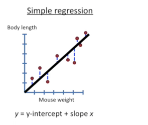
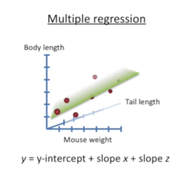
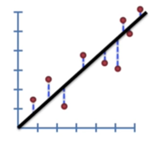
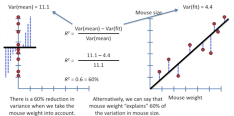
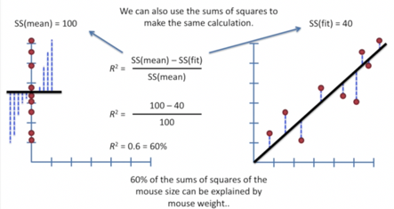
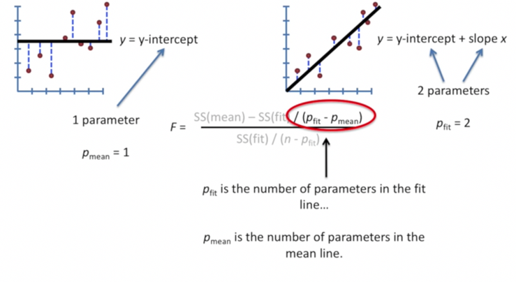
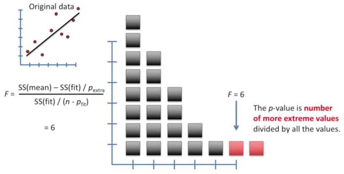

# Linear regression

**1.** Linear regression has two types: simple regression and multiple regression 

 

 

**2.** Sum of squared residuals: residuals are the differences between real data and the line, we are summing the   square of these values.

        Sum of squared residuals=((a*x1+b)-y1)2+((a*x2+b)-y2)2+.... -->cost function

 

**3.** We want the line that give us the smallest sum of squares, this method for finding the best values for “a”   and “b” is called “least squares” , we do this by taking the derivative and finding where it is equal to zero.   But sometimes it is very hard to find the value that makes it directly equal to zero,so we use gradientdescent method

**4.** Linear regression: Use least squares method to fit a line to the data ( We use R2 and P-value to evaluate the performance of the regression model )

 

**5.** R2 coefficient of determination: R2= SSR/ SST=1- SSE/ SSTquantifies the relationship in the data, needs to  be large
             (1)	SS(mean) =(data – mean)2  =SST (总平方和 ) 
             (2)	SS(fit) = (data – fit)2 =SSE (残差平方和 )
             (3)	SSR (回归平方和 ) = (fit – mean)2
             (4)	Var(mean) = (data – mean)2/n = SS(mean)/n
             (5)	Var(fit) = (data – fit)2/n = SS(fit)/n

 

There is a 60% reduction in variance when we take the mouse weight into account, or Mouse weight explains 60% of the variance in mouse size.

**6.** F-score:

 

**7.** P-value: determines how reliable that relationship is, needs to be small

 

According to the above graph: p-value=2/23=0.0895

Regression analysis is a form of inferential statistics. The p-values help determine whether the relationships that you observe in your sample also exist in the larger population. The p-value for each independent variable tests the null hypothesis that the variable has no correlation with the dependent variable.

If the p-value for a variable is less than your significance level, your sample data provide enough evidence to reject the null hypothesis for the entire population. Your data favor the hypothesis that there is a non-zero correlation. Changes in the independent variable are associated with changes in the response at the population level. This variable is statistically significant and probably a worthwhile addition to your regression model. On the other hand, a p-value that is greater than the significance level indicates that there is insufficient evidence in your sample to conclude that a non-zero correlation exists.

**8.** MSE: mean squared error, another loss function, similar to Sum of squared error.
       mean squared error=expectation of the squared error (误差平方的期望)

