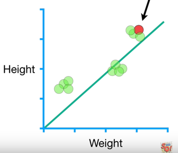
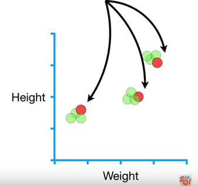
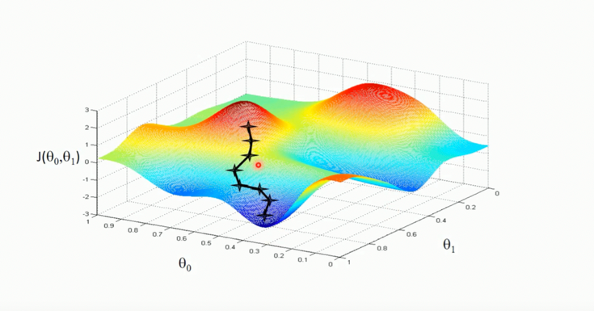
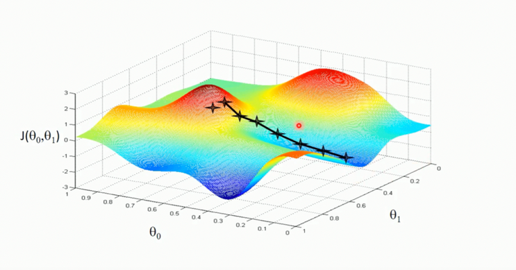

# Gradient Descent

**9.** Gradient descent:  a way to achieve minimum squares of error, this method can also be used to optimize other things.
    Gradient descent has three types: 
       •	Batch gradient descent
       •	Mini-batch gradient descent
       •	Stochastic gradient descent

 

 

    (1)Batch gradient descent
    
       •	In each iteration step, all the data of the training set should be used. If the number of samples is             
            large, the speed is slow.
            
       •	Gradient decent only does few calculations far from the optimal solution, and increases  
            the number of the calculations closer to the optimal value--> Gradient decent identifies the optimal            
            value by taking big steps when it is far away and baby steps when it is close.
            
       •	We take the derivative of the sum of the squared residuals (loss function)
       
       •	Calculation process example:
                      **Step one:**
                        Sum of the squared residuals=(1.4 - (intercept + slope*0.5))2
                                                    +(1.9 - (intercept +slope*2.3))2
                                                    +(3.2 - (intercept +slope*2.9))2
                      **Step two:**
                        d/d intercept sum of the squared residuals=
                                                     -2(1.4 - (intercept + slope*0.5)
                                                    +-2(1.9 - (intercept + slope*2.3)
                                                    +-2(1.9 - (intercept + slope*2.3)
                        d/d slope sum of the squared residuals=
                                                    -2*0.5(1.4 - (intercept + slope*0.5)
                                                    +-2*2.9 (1.9 - (intercept + slope*2.3)
                                                    +-2*2.3 (1.9 - (intercept + slope*2.3)
                      **Step three:** start by taking intercept = 0 and slope = 1
                        d/d intercept sum of the squared residuals=
                                                     -2(1.4 - (0 + 1*0.5)
                                                    +-2(1.9 - (0 + 1*2.3)
                                                    +-2(1.9 - (0+ 1*2.3)=-1.6
                        d/d slope sum of the squared residuals=
                                                     -2*0.5(1.4 - (0 + 1*0.5)
                                                    +-2*2.9 (1.9 - (0 + 1*2.3)
                                                    +-2*2.3 (1.9 - (0 + 1*2.3)=-0.8
                      **Step four:** 
                        Step size intercept= -1.6*learning rate=-1.6*0.01=-0.016
                        Step size slope= -0.8*learning rate= -0.8*0.01=-0.008
                        
                      **Step five:**
                        New intercept=old intercept – step size= 0.016
                        New slope=old slope – step size = 1.008
                        
                        Return to step 3 and redo the following steps until the step size is extremely close to 0. 
                        Then we got the final slope an intercept for the fitting line

    (2)Stochastic gradient descent
        
       •	Stochastic gradient descent is especially useful then there are redundancies in the data. It is great             
            when there is tons of data and a lot of parameters. And can easily update the parameters when new     
            data shows up       

 

 

    (3)Mini-batch gradient descent
        
       •	Select mini-batch for each step
       •	Take the best of using just one sample and all of the data at each step. Similar to using all of the   
            data, using a mini-batch can result in more stable estimates of the parameters in fewer steps. Like    
            using just one sample per step, it is much faster than using all of the data

 

    10.Note:

    (1) the result of gradient descent is not always the greatest result due to the different initial intercept and 
        slope. But still towards to the optimization direction.

 

 

    (2) learning rate should be carefully chosen, can’t be too small  (too slow), can’t be too large(can’t reach         
        the optimize point). Can try 0.2/ 0.03/ 0.01/ 0.003/ 0.001/ 0.0003/ 0.0001..

 

