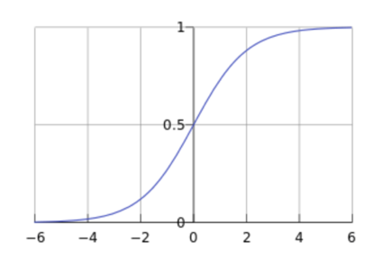

# 1. Logistic Regression -- standard logistic regression

**1.1**	Logistic Regression is a machine learning method used to solve the binary classification (0 or 1) problem, which is used to estimate the likelihood of something. Like the possibility that a patient has a disease

 
 

**1.2**	Odds = p(occurring) / p(not occurring) = p / (1-p); Odds ratio is the ratio of two odds

**1.3**	To link the independent variables(x) to Bernoulli distribution (p), logistic regression is transformed from the “probability” to the “log(odds) “so the y-axis can go from -infinity to +infinity.

             Loge(p/(1-p)) = a + bx (left: -infinity to +infinity; right: -infinity to +infinity)
      
    and we then can write the above function into function: 

             p(y=1|x)= ea+bx / (1+ ea+bx ) this function is a type of sigmoid function(logistic function)
             
 

    For continuous independent variable, we only need the log(left), but for discrete independent variable we   
    also need to log(right), same idea with log(left).
    
              •	Log(odds)=log(odds category1)* category1+((log(odds category2)- log(odds category1))* category2
              •	log(odds category1)-->a
              •	(log(odds category2)- log(odds category1)-->b
              •	category1, category2 --> 0 or 1

 

**1.4**	Sigmoid function (logistic function): f (z) = 1 / (1+ e-z ) 

 

From the figure above, we can see that the sigmoid function is an s-shaped curve with values between [0, 1], and the value of the function will soon approach 0 or 1 away from 0. This characteristic is very important for solving dichotomies problems

**1.5**	Use the maximum likelihood to find the best fitting line (example of continuous independent variable)

    a)Project the original data points onto the candidate line, this gives each sample a candidate log(odds) value. e.g. the first left point : the log(odds)=-2.1; the second left point: the log(odds)=-1.4

 

    b)According to the value of log(odds), calculate the probability(p)

 

    c)Substitute 2.1 for the log(odds) --> log(p/(1-p))=-2.1 --> p=0.1. same thing, we can calculated every probability, but probability not always = likelihood.The likelihood for the blue point(y=1) is the probability, The likelihood for the red point(y=0) is the (1- probability).
    
         In this example:
         Likelihood of data given the squiggle=0.49*0.9*0.91*0.91*0.92*(1-0.9)*(1-0.3)*(1-0.01)*(1-0.01).
         
         Statisticians prefer to calculate the log of the likelihood, but either way works:
         log0.49*log0.9*log0.91*log0.91*log0.92*log(1-0.9)*log(1-0.3)*log(1-0.01)*log(1-0.01)=-3.77

    d) Then we rotate the line to calculate another likelihood and find the biggest one. The algorithm that finds the line with the maximum likelihood is pretty smart-each time it rotates the line, it does so in a way that increases the log-likelihood. Thus the algorithm can find the optimal fit after a few rotations. Ultimately we get a line that maximize the likelihood and that’s the one chosen to have the best fit.

# 2. Softmax regression

**2.1** Softmax Regression (Multinomial Logistic regression/ Maximum Entropy Classifier/ Multi-class Logistic Regression): is a generalization of logistic regression that we can use for multi-class classification. In contrast, we use the (standard) Logistic Regression model in binary classification tasks. Softmax turn a vector of numbers (called logits) into a probabilities that sum to one. The probability represents this sample to be each categories’ probability.

 

**2.2**	Softmax function:

 

**1.3**	Calculation process:

 
 
 
 

**1.4**	Common activation function:

 

# 3. Loss Function

**3.1** 

Regression: L2-Norm Loss

Classification: cross-entropy

 

e.g. [0,1,0]-->softmax function-->[0.4,0.4,0.2]-->loss function=-0*ln0.4-1*ln0.4-0*ln0.2=0.92
the less loss, the more accurate.

**3.2**	Difference between loss function, cost function and object function

1)Loss Function is defined on a single sample, and the error of a sample is calculated.

2)Cost Function is defined over the entire training set, which is the average of all the sample 
    errors, which is the average of the loss Function.
    
3)Object Function is defined as: Cost Function + regularization item.

 
 

•	L1 norm is to make the weight more sparse so that the weight can be changed to 0 for feature selection so that the model has a good interpretation. The L2 norm does not make the weight zero, but only as small as possible, so that each feature has only a small effect on the prediction effect of the model

•	The L1 regular term isoline and the original loss function isoline are more likely to intersect on the coordinate axis, so that the sparse solution of L1 can be obtained. However, the regular term isoline of L2 norm and the original loss function isoline are more likely to intersect in a certain quadrant, so L2 will make the weight smaller rather than sparse

# 4. Regularization

**4.1** Regularization is the general name of a class of methods that introduce additional information to the original model at this time in order to prevent overfitting and improve the generalization performance of the model-->Add some rules to your model, add a priori, reduce the solution set, reduce the probability of error

**4.2**	Object function= Cost function + penalty term

 

Note: 

1)theta: coefficient  
      2)L1-norm: square  
      3)L2-norm: absolute

**4.3** L1-norm (LASSO regression), L2 norm (Ridge regression) and their difference

     **4.3.1** L2-norm: Ridge regression 

    We saw that least squares results in a line(red) that is over fit and has high variance. Ridge regression is to find a new line(blue) that doesn’t fit the training data as well and introduce a small amount of bias into how this new line is to fit to the data. but in return for that small amount of bias, we get a significant drop in variance. Ridge regression helps reduce variabce by shrinking parameters and making our predictions less sensitive to them.

 
 

    Least square(red)line minimize the sum of the squared residuals, ridge regression(blue)line minimize the sum of the squared residuals+ lambda*sum of the coefficients square. 

 

    Lambda determines how severe that penalty is. Lambda can be determined by cross validation(with least loss) can be any value from 0 to positive infinity. When increasing lambda, the slope tends to be flat (to be 0).
    When there isn’t enough data to find the least squares parameter estimates, ridge regression can still find a solution with cross validation and ridge regression penalty.

     **4.3.2** L1-norm: Lasso regression 
     
     LASSO regression line minimize the sum of the squared residuals+ lambda*sum of the  absolute of coefficients.

 

    **4.3.3** difference: 
    1) Ridge regression can only shrink the slope asymptotically close to 0 while lasso regression can shrink the slope all the way to 0
    2) lasso regression can exclude useless variables from equations, this makes the final equation simpler and easier to interpret. 
    (when there are lots of useless variables, choose lasso regression since it can help us better choose features)
    3) when there are lots of useful variables, Ridge regression can give a better results than lasso regression

Process: 

Step1:

 

The terms for weight and high fat diet are both reasonable things to use to predict size. But the astrological offset and the airspeed of a swallow are terrible ways to predict size.

Step2:

When we apply ridge regression to this equation, we find the minimal sum of the squared residuals plus the ridge regression penalty(top)/lasso regression penalty(bottom):

 
 

Step3:

**Ridge regression:** When increase lambda, the coefficients of weight and high fat diet shrink a little bit. But the coefficients of astrological offset and the airspeed of a swallow shrink a lot but never be equal to 0

**Lasso regression:** When increase lambda, the coefficients of weight and high fat diet shrink a little bit. But the coefficients of astrological offset and the airspeed of a swallow go all the way to 0, and these terms go away.

 

We are left with a way to predict size that only includes **weight** and **high fat diet**.

 

