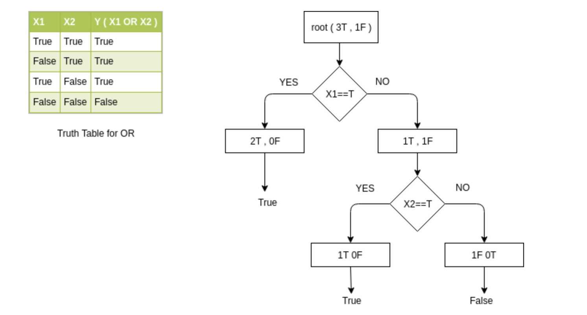
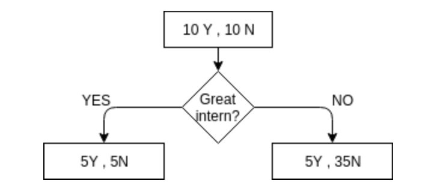
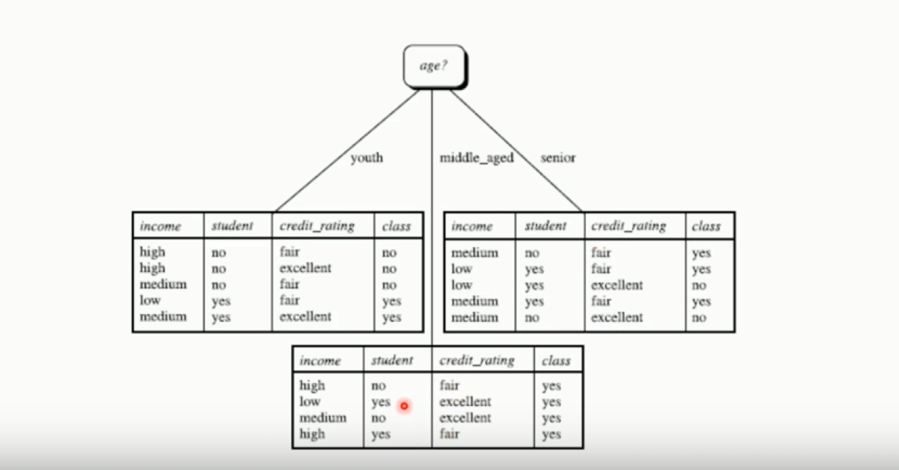
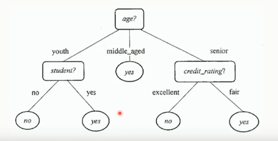
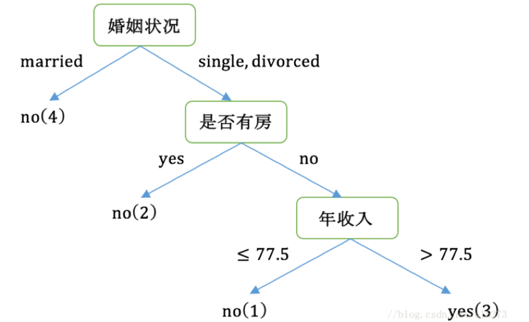
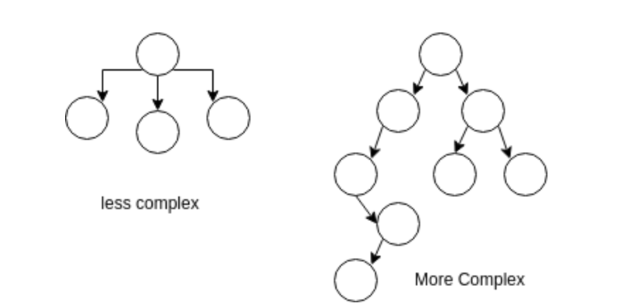
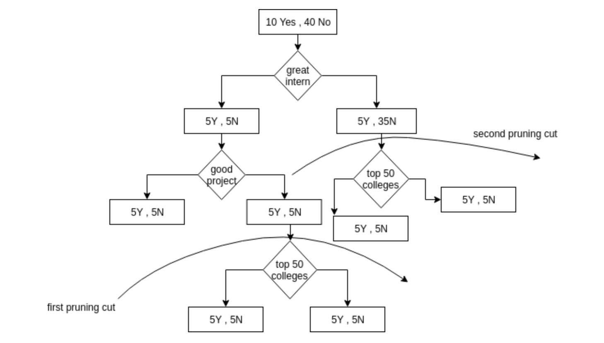
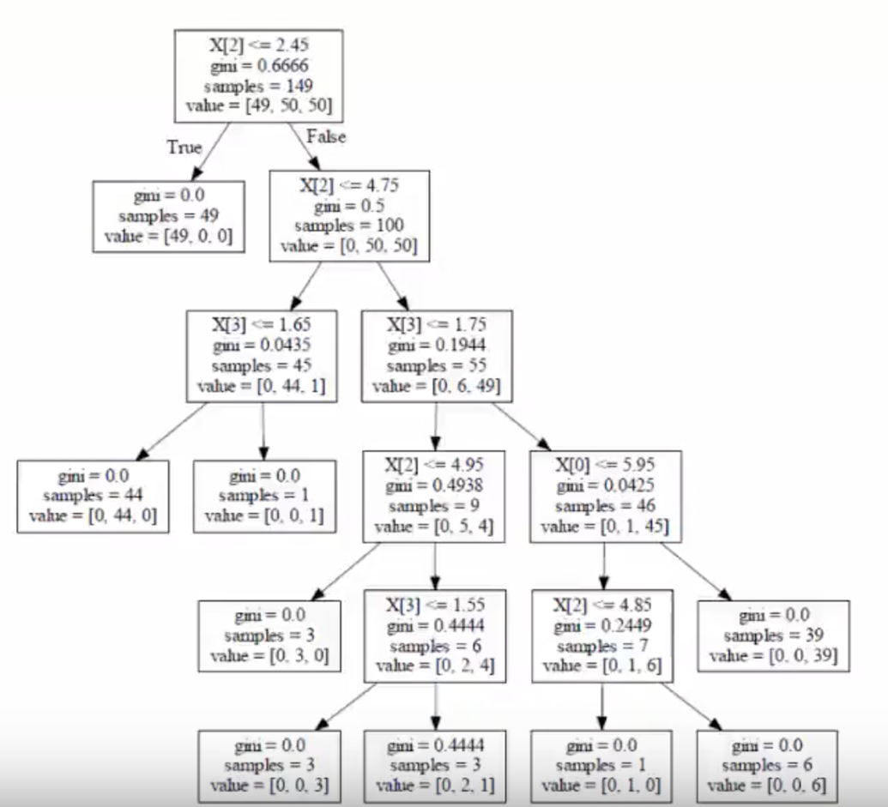

# Decision Tree

A decision tree is a graph that uses a branching method to illustrate every possible outcome of a decision. Lets start by taking a example of OR of two variables X1 and X2. The decison tree for the same is shown below :

 

We have total four possible combinations as shown in the truth table. So at the beginning we have 2 True and 2 False outcomes to start with. The first condition we check for is the value of X1. If X1 is true then we are sure that the result will be true and hence we arrive at 2 true and no false. Note that ,we only consider those rows of the table which are having X1 as true i.e. the first and the third row in the current example .That is why we have 2 total outcomes out of which 2 are true and none is false. This node is having a definite answer.If we arrive at this node there is no confusion as to which what our tree should return, therefore these are called pure nodes.
If X1 is false then the answer is dependant on the value of X2. If X2 is false the answer is false and if the answer is true the final result is true. We have three pure nodes here as shown in the pictorial representation of the decision tree. Now if we are given any new data for prediction we just need to run it through our tree. For example if we get A and B as two values for testing. We check first if A is true. If A is true we have true as our answer else we need to check for the value of B. If B is true then our answer agin is true else we have false as the final outcome. Lets consider another example which is not as straight forward as the previous one. Suppose we need to predict that if a person will get interview call or not based on some factors. There can be many factors but for simplicity lets consider that we focus on the level of projects, good inten and whether the person is from top 50 colleges or not.
Unlike the previous example in which we just picked X1 for the first decision, it is quite arguable that which factor should we pick first here. Lets assume that we start by picking whether the person has done a good internship or not(which is in the form of true or false).

 

## Best Decision Tree

Building a decision tree involves deciding on which feature to choose and what condition to use on splitting, alongwith knowing when to stop.
In the first split on the root, all features are considered and the data points are divided into groups based on this split. Lets suppose, we have n features. Then we will be having n candidate splits at the first level. Now, we will calculate how much accuracy each split will cost us, using a function. The split(feature) which results in maximum accuracy is choosen at this level and data points are divided into child nodes according to that feature only. The child nodes formed are recursively divided into deeper levels, resulting in formation of the entire tree.

In the case we have n features, then we can possibly make exponential number of decision trees. It is categorised into NP-HARD Problem. For finding out the best tree all possible combinations of tree possible should be taken care off. So, we are interested here to find out the good tree and not the best one. Using the GREEDY approach, we will try to lower the cost (and also maximize the accuracy) and according to this, build a good decision tree.

##  Handle discrete and continuous value features

If we have discrete value feature, say labelled data for example gender of a person we have Male and Females. Now, making a split on gender of person results in 2 child nodes, one for males and other for females.
 
Consider continuous valued features, say salary. Every person has different salary and values are spread over a wide range. If we have to make a split on Salary, then an option is to make different child node for every different value of salary we obtain. But unfortunately, it will result in large overfitting of data.
 
So, to avoid this difficulty for continuous value features. We follow the procedure mentioned to achieve the better split using this feature.

1. Spread all the salaries(values for feature choosen) on the straight line from lowest to highest order.
2. Split the data according to mid point values, taking all the pairwise adjacent points.
3. Take the salary value for that particular split that results in maximum accuracy or minimum mistakes made while making the decision. 

Example, we have 4 value of salaries, 5000, 10000, 20000 and 50000.
We take the mid point of all these which comes out to be 7500, 15000 and 35000.
We will make a split on all these salary values one by one, first on 7500 salary, which means people with salary less than 7500 come on left side and all others on the right side. 
Similarly, doing for salary values 15000 and 35000.
We choose that particular salary value to make a split at this level which results in maximum accuracy.

This process is followed for making a binary split for the continuous value features. We can choose salary feature again at the deeper level and make a split again using this feature below, with decreased range.

Difference among ID3, ID4.5, CART is that these three algorithms use different methods to select features (divide nodes):
1.	ID3: information gain(信息增益)
2.	ID4.5: information gain ratio(信息增益率)
3.	CART: Gini index（基尼指数）

## 1. ID3
Choose the feature with biggest information gain

| RID | age      |income   |student  |credit_rating| class:buys_computer|
|-----|----------|---------|---------|-------------|--------------------|
|1    |youth     |high     |no       |fair         |no                  |
|2	  |youth     |high	   |no	     |excellent	   |no                  |
|3	  |middle_age|high	   |no	     |fair	       |yes                 |
|4	  |senior	 |medium   |no	     |fair	       |yes                 |
|5	  |senior	 |low	   |yes	     |fair	       |yes                 |
|6	  |senior	 |low	   |yes	     |excellent	   |no                  |
|7	  |middle_age|low	   |yes	     |excellent	   |yes                 |
|8	  |youth	 |medium   |no	     |fair	       |no                  |
|9	  |youth	 |low	   |yes	     |fair	       |yes                 |
|10	  |senior	 |medium   |yes	     |fair	       |yes                 |
|11	  |youth	 |medium   |yes	     |excellent	   |yes                 |
|12	  |middle_age|medium   |no	     |excellent	   |yes                 |
|13	  |middle_age|high	   |yes	     |fair	       |yes                 |
|14	  |senior	 |medium   |no	     |excellent	   |no                  |

Formula: Gain(A) = info(D) - info_n(D)

**1.	First node(feature)**

**(1)**	9 out of 14 are yes and 5 out of 14 are no:
            info(D) = -(9/14) log2(9/14) - (5/14)log2(5/14) = 0.940bits (entropy信息熵)
            
**(2)**	5 out of 14 are youth (3 no and 2 yes), 4 out of 14 are middle_age (4 yes), 5 out of 14 are senior (3 yes and 2 no): 
infoage(D) = (5/14)*( -(2/5)log2(2/5)-(3/5)log2(3/5))
                  +(4/14)*( -(4/4)log2(4/4)-(0/4)log2(0/4))
                  +(5/14)*( -(3/5)log2(3/5)-(2/5)log2(2/5))=0.694bits
                  
**(3)**	Gain(age)= info(D) - infoage(D)=0.246bits

**(4)**	Similar: Gain(income)=0.029; Gain(student)=0.151; Gain(credit_rating)=0.048
We can know that age has the biggest information gain, so we choose age as the first feature (node).

 

**2.	Second node(feature)**

In each table we do the same thing as step1(choosing first feature), calculate the gain(income), gain(student) and gain(credit_rating) based on the new table and then choose one with biggest information gain.

 

## 2. ID4.5:
Choose the feature with biggest information gain ratio

| outlook | temperature     |humidity   |Windy  | Event(if cancel)|
|-----|----------|---------|---------|-------------|
Sunny|	Hot|	High|	Weak|	Cancel
Sunny|	Hot|	High|	Strong|	Cancel
Overcast|	Hot|	High|	Weak|	Not cancel
Rainy	|Mild|	High|	Weak|	Not cancel
Rainy	|Cold|	Normal|	Weak	|Not cancel
Rainy	|Cold|	Normal|	Strong|Cancel
Overcast|	Cold	|Normal	|Strong	|Not cancel
Sunny	|Mild	|High	|Weak	|Cancel
Sunny	|Cold	|Normal	|Weak	|Not cancel
Rainy	|Mild	|Normal	|Weak	|Not cancel
Sunny	|Mild	|Normal	|Strong|	Not cancel
Overcast	|Mild	|High	|Strong	|Not cancel
Overcast	|Hot	|Normal	|Weak	|Not cancel
Rainy	|Mild	|High	|Strong	|Cancel

**1.	First node(feature):**

**(1)**	9 out of 14 are Not cancel and 5 out of 14 are Cancel:
            info(D) = -(9/14) log2(9/14) - (5/14)log2(5/14) = 0.940bits(entropy信息熵)
            
**(2)**	5 out of 14 are Sunny (3 Cancel and 2 Not cancel), 4 out of 14 are Overcast (4 Not cancel), 5 out of 14 are Rainy(3 Not cancel and 2 Cancel): 

         InfoOutlook(D) = (5/14)*( -(2/5)log2(2/5)-(3/5)log2(3/5))
                     +(4/14)*( -(4/4)log2(4/4)-(0/4)log2(0/4))
                     +(5/14)*( -(3/5)log2(3/5)-(2/5)log2(2/5))=0.694bits
                     
**(3)**	Gain(Outlook)= 0.940-0.694=0.246bits

**(4)**	Sunny :5 out of 14; Rainy : 5 out of 14 ; Overcast: 4 out of 14: 
        
        Split Information(分类信息度量) = -(5/14)*log(5/14) -(5/14)*log(5/14) -(4/14)*log(4/14)=1.577406282852345

**(5)**	Information gain ratio(Outlook)=information gain/ Split Information
        =0.246/1.577406282852345=0.15595
        
        Similar IGR(Temperature)=0.0186297; IGR(Humidity)=0.151; IGR(Windy)=0.0487196

We can know that Outlook has the biggest information gain ratio, so we choose Outlook as the first feature (node).

**2.    Second node(feature):**

In each branch, we do the same thing as step1(choosing first feature), calculate the IGR(Temperature), IGR(Humidity) and IGR(Windy) based on the new table and then choose one with biggest information gain ratio as the second feature

## 3. CART: 
Choose the feature with biggest Gini index gain

CART assumes that the decision tree is a binary tree, and the characteristic values of internal nodes are "yes" and "no", the left branch is the branch with the value of "yes", and the right branch is the branch with the value of "no". The CART decision tree can be used for both classification and regression. CART algorithm consists of the following two steps:

1.	Decision tree generation: a decision tree is generated based on the training dataset, and the generated decision tree should be as large as possible.

2.	Decision tree pruning: pruning the generated trees with the testing dataset and selecting the optimal subtree, then the minimum loss function is used as the pruning standard.

| if have house | marital status    |annual income  |whether default | 
|-----|----------|---------|---------|
Yes|	Single|	125K|	No
No|	Married|	100K|	No
No|	Single|	70K|	No
Yes|	Married|	120K|	No
No|	Divorced|	95K|	Yes
No|	Married|	60K|	No
Yes|	Divorced|	220K|	No
No|	Single|	85K|	Yes
No|	Married|	75K|	No
No|	Single|	90K|	Yes

### 3.1 Decision tree generation

**1.1	First node(feature):**

**(1)**	7 out of 10 are Not default and 3 out of 10 are default:

        Gini (whether default) =1-(3/10)^2-(7/10)^2=0.42

**(2)**

   **If have house:**
    
        Gini (right node) = 1-(3/7)^2-(4/7)^2=0.4898
        Gini (left node) = 1-(0/3)^2-(3/3)^2=0
        Gain (if have house) =0.42-(7/10)* 0.4898-(3/10)*0=0.077

   **Marital status:**
   
       a.	{married} | {single, divorced}:
            Gini (left node) = 1-(0/4)^2-(4/4)^2=0
            Gini (right node) = 1-(3/6)^2-(3/6)^2=0.5
            Gain ({married} | {single, divorced}) =0.42-(4/10)* 0-(6/10)*0.5=0.12
       b.	Similar Gain ({single} | {married, divorced})=0.053
            Gain ({divorced} | {single, married})=0.02
       
Compared with the calculated results, when dividing the root node according to the marital status attribute, the group with the largest Gini coefficient gain is taken as the partition result, which is {married} | {single, divorced}.

**Annual income:**

For the annual income attribute to be numerical, the data should first be sorted in ascending order, and then the sample should be divided into two groups with the median value of adjacent values as the separation from small to large. For example, when faced with the two values of annual income of 60 and 70, we calculate the median value of 65. Then choose the median value with the biggest Gini index as the split point. (here we chose 77.5)

        Gain (Annual income) =0.42-(1/10)* 0-(9/10)*[1-(6/9)^2-(3/9)^2]=0.02

We can know that Marital status ({married} | {single, divorced}) has the biggest Gini index gain, so we choose this feature as the first feature (node).

**1.2	Second node(feature)**

In each branch, we do the same thing as step1(choosing first feature), calculate the GIG(if have house), GIG(Annual income) based on the new table and then choose one with biggest Gini index gain as the second feature.

 

### 3.2 Decision tree pruning

Pruning is a technique in machine learning that reduces the size of decision trees by removing sections of the tree that provide little power to classify instances. Pruning reduces the complexity of the final classifier, and hence improves predictive accuracy by the reduction of overfitting.
Consider the two D-Trees shown below:

 

As we can see , the first tree is less complex than the second tree. Complexity can increase due to Depth as well as the nodes at a level. We cannot decide just on the basis of Depth or just on the basis of number of nodes at a level.
We add to our original cost a parameter lamda(λ) so that

**Cost = Error_function(Training data) + λ*L(T)**
where, λ=controlling factor and L(T)=no. of leaf nodes.
We start from the bottom of the tree and check for each split. As we encounter a split we decide if we want to keep that split or if we should keep the parent node of that split instead based upon the entropy and cost function of both the situations. If we decide to keep the split, we also have to keep all the splits above that particular split.
Consider the example shown below of a D-Tree of getting an interview call based upon good project , great intern and the type of college.

 

without pruning we have our cost as 0.02 + 0.05 = 0.07 ( taking λ as 0.01 ans 1/50 from error function )
After first pruning we have 0.02+0.04 = 0.06, therefore we remove the first split and do pruning.
Now if we undo the second split also i.e. do pruning 2nd time as shown above, we get cost = 0.12+0.03=0.15 . Here error has increased too much, therefore, we should keep the split as it is. Because we are keeping this split we need to keep all the splits above this also.

**2.1	pre-pruning:**

pruning when building trees (more practical) 
impose restrictions on max_depth(深度/number of features), max_leaf_nodes（叶子节点个数）, min_sample_split（叶子节点样本数），information gain

**2.2	post-pruning:**

pruning after building trees
according to criteria: Calpha(T)=C(T)+alpha*|Tleaf|. more leaf nodes, more loss
decide if one node should split by comparing Calpha(T), if Calpha(T) before > Calpha(T) after, we choose to split, if not, then do not split.

  
