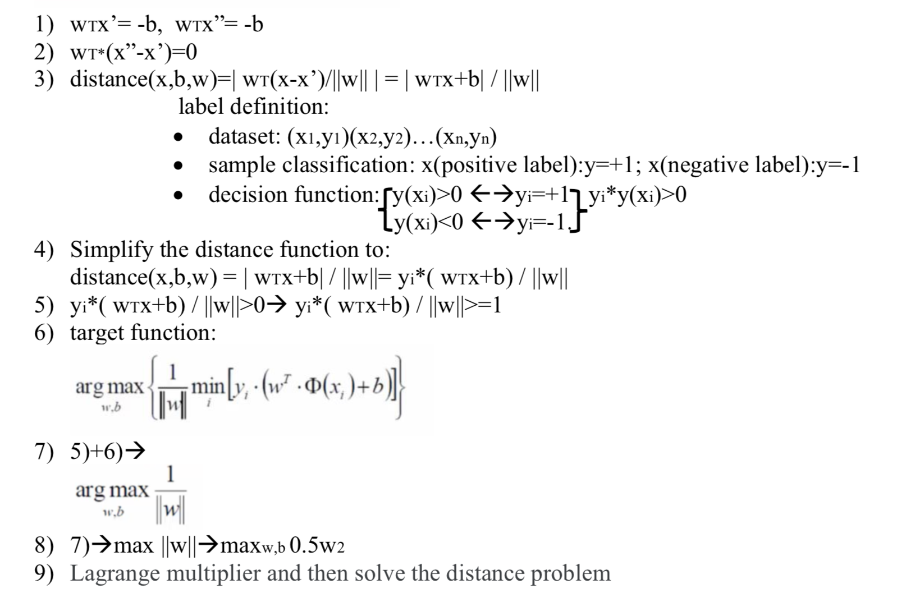
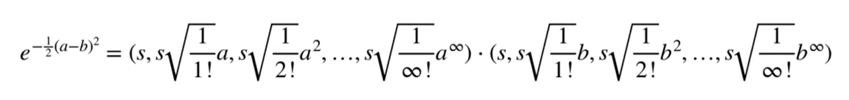

# Support Vector Machines

1.SVM is a kind of binary classification model, its goal is to find hyperplane (which has the largest margin) to classify. Only points with arrow are support vectors, others doesn’t influent the hyperplane![image.png]

Support vector machine (SVM) is a powerful and versatile machine learning model. **can perform linear or nonlinear classification, regression, and even outlier detection.** It is one of the most popular models in machine learning, and anyone interested in machine learning should use it in their toolbox. **SVM is particularly suitable for classification of complex but small or medium-sized data sets **. 

## **Following part shows SVM principle, calculation and parameter explanation in python**

# 1. Linear SVM Classification

some classes can be easily separated by straight lines (they are **linearly separable**).
* The left figure shows the **decision boundary** of three possible linear classifiers. **the model with decision boundaries represented by dashed lines is very bad** and does not even classify properly.
* The other two models work perfectly on this training set, but their decision boundaries are very close to the instance, and these models may not perform well on the new instance.
* In contrast, the SVM classifier decision boundary **is represented by the** solid line in the figure on the right. This line not only separates the two classes, but also **as far away from the nearest training instance as possible**.

You can think of the SVM classifier as the widest ** interval (represented by a parallel dashed line) suitable for classes. This is called the maximum spacing classification.
 

Note that adding more training instances outside of the interval does not affect the decision boundary: **it is entirely determined (or "supported") by the instance above the interval**. These instances are called **support vectors** (the circled points in the figure above).

**SVM is sensitive to feature scale**, as shown in figure 5-2: in the left figure, the vertical scale is much larger than the horizontal scale, so the widest interval is close to the horizontal. After feature scaling (for example, StandardScaler using scikit-learn), the decision boundary looks much better (on the right).
 

### 1.1 Soft Margin Classification

（1）If we strictly enforce that all instances are outside the interval and correctly on either side of the interval, this is called **hard interval maximization classification**. There are two main problems with maximizing hard interval classification:

* first, it only works if the data is **linearly separable**,
* second, it **is very sensitive to outliers**.

The data set shown below has only one additional outlier: on the left, it is impossible to find a hard interval, and on the right, the decision boundary ends up being very different from what we saw in the previous section with no outliers, and it may not be very generalized.
 

To avoid these problems, it is best to use a more flexible model. The goal is to find a good balance between keeping the street as large as possible and limiting misclassification (that is, instances in the middle of the street or even on the wrong side). This is called **soft interval classification**.

（2）calculation of (half) margin:
 
 

（3）In scikit-learn's SVM classes, we can control this balance using the **C superparameter** : **smaller C values lead to wider spacing but more misclassification**. Figure 5-4 shows the decision boundary and interval of two soft-interval SVM classifiers on **nonlinear fractional data set** :
* on the left, using the **higher C value**, the classifier will reduce misclassification, but will end up with a smaller interval.
* on the right, with the **lower C value**, the spacing is much larger, but many instances end up within the spacing.

However, it seems that the second classifier might be better generalized: in fact even on this training set it would reduce the prediction error, because most misclassifications are actually on the right side of the decision boundary.
 

（4）If your SVM model is overfitting, you can try to regularize it by **reducing C**

**（5）Unlike the Logistic regression classifier, the SVM classifier does not output the probability of each class**。

- You can use the **SVC class **, using **SVC (kernel = "linear", C = 1) **, but it is much slower, especially for large training sets, so it is not recommended

- Another option is to use the **SGDClassifier class**, which USES **SGDClassifier (loss = "hinge", alpha = 1 / (m * C))**. This applies to regular random gradient descent to train the linear SVM classifier. It does not converge as quickly as the LinearSVC class, but it can be used to handle large data sets that are not suitable for memory (out-of-core training), or to handle online classification tasks.

**（6）the LinearSVC class** normalizes the deviation term, so it should
* **first, the average value is subtracted to make the training center**. This is done automatically if you scale the data using StandardScaler.
* also, be sure to set the loss superparameter to "hinge", **because it is not the default value**.
* Finally, for better performance, you should set the dual super parameter to False, unless there are more features than training instance

## 2 Nonlinear SVM Classification

While linear SVM classifiers are efficient and work very well in many ways, many data sets cannot even be linearly separated. **one way to deal with nonlinear data sets is to add more features**, such as **polynomial features** (as described in chapter 4); In some cases, this may result in linearly separable data sets.

Consider the left figure below: it represents a simple dataset with only one feature, $x_1$. As you can see, this data set is not linearly separable. But, if you add a second feature **** $x_2 = (x_1) ^ 2 $, **to get the 2 d data sets can be linear separated completely**.

 

### 2.1 Polynomial Kernel

Adding polynomial features is easy to implement and can be applied to all types of machine learning algorithms (not just SVM), however

* it can't handle very complex data sets in low-order polynomials,
* in higher order polynomials it produces a lot of features that make the model too slow.

Fortunately, when using SVM, you can apply an almost miraculous mathematical technique called the **kernel technique**. **it can yield the same results as adding many polynomial features**, even using very high polynomials without actually adding them. Therefore, since you don't actually add any features, there is no combination explosion of feature Numbers. This 

(1) calculation:
       
       (a*b+r)d : 1) a, b refer to two different observations in the dataset
       
  

                  2) r determines the coefficient of the polynomial
                  
                  3) d sets the degree of the polynomial
                  
                  Note: r and d are determined by cross validation
                  
       Example: r=1, d=2
       
 
 
 

(2) in python

This technique is implemented by the SVC class. Let's test it 
   
    from sklearn.svm import SVC
    poly_kernel_svm_clf = Pipeline([
         ("scaler", StandardScaler()),
         ("svm_clf", SVC(kernel="poly", degree=3, coef0=1, C=5))
         ])
    poly_kernel_svm_clf.fit(X, y)
    
The above code USES a cubic polynomial kernel to train the SVM classifier. It is shown on the left side of figure. On the right is another SVM classifier that USES a 10th-degree polynomial kernel. Obviously,

* if the model is overfitting, you may want to reduce the degree of the polynomial.

* if it doesn't fit, you can try to increase it.

**the superparameter coef0** control model is influenced by the degree of high degree polynomial and low degree polynomial.

 

### 2.2 Gaussian RBF Kernel

Another technique for solving nonlinear problems is to **add features calculated using similarity functions**, which measure how similar each instance is to a particular landmark. For example,

* let's take the one-dimensional data set discussed earlier and add two landmarks to it at $x_1 = -2$and $x_1 = 1$(see figure, left).

* next, let's define the similarity function as the gaussian radial basis function (RBF) of $0.1 = $0.3 (see formula 5-1).

It is a bell function, ranging from 0 (far from the landmark) to 1 (at the landmark). Now we are ready to calculate the new feature. For example, let's look at the example **$x_1 = -1$** : it is located **1** from the first landmark and **2** from the second landmark. Therefore, the new features is $x_2 = exp (0.3 x 1 ^ 2) material 0.74 $and $x_3 = exp (0.3 x 2 ^ 2) material  is  $0.30.

 

The figure to the right of figure shows the transformed data set (with the original feature removed). As you can see, it is now linearly separable.
Like the polynomial feature approach, the **similarity feature approach can be used for any machine learning algorithm**, the **kernel technique does it**. Let's use the SVC class to try **gaussian RBF kernel** :

(1)calculation:
 
 
              
            The radial kernel behaves like a weighted nearest neighbor model, in other words, the closest 
            observations have a lot of influence on how we classify the new observations and observations that 
            are further away have relatively little influence on the classification.
            1)a and b refer to two different observations in the dataset
            2)the difference between the measurements is then squared, giving us the squared distance between 
              the two observations.
            3)Gamma is determined by cross validation, scales the squared distance and thus scales the 
              influence.
                
  
 
            4)How radial kernel determines how much influence each observation in the training dataset has on 
                classifying new observations:
                
                (1)	Gamma = 1, near point: e-(2.5-4)^2=0.11(high-dimension relationship)
                
  
 
                (2)	Gamma = 1, far away point: e-(2.5-16)^2=almost to 0!
                
  
 
                Near point has big influence and far away point has little influence.
                
            5)Like polynomial kernel, radial kernel also turns the points into high dimensions:
  
            

(2) in python

    rbf_kernel_svm_clf = Pipeline(( 
        ("scaler",StandardScaler()),
        ("svm_clf",SVC(kernel="rbf",gamma=5,C=0.001))
     ))
    rbf_kernel_svm_clf.fit(X,y)

* increasing gamma γ Narrows the bell curve (see figure on the left), so that each instance has a smaller scope of influence: the decision boundaries eventually become more irregular, oscillating around individual instances.

* reducing the gamma γ widens the bell curve, so the example has a wider range of influence and the decision boundary is smoother.

**regularized superparameter** :
* if your model is overfitting, you should reduce it,
* if it is underfitting, you should increase it (similar to the c-super parameter).

from sklearn.svm import SVC

gamma1, gamma2 = 0.1, 5
C1, C2 = 0.001, 1000
hyperparams = (gamma1, C1), (gamma1, C2), (gamma2, C1), (gamma2, C2)

svm_clfs = []
for gamma, C in hyperparams:
    rbf_kernel_svm_clf = Pipeline([
            ("scaler", StandardScaler()),
            ("svm_clf", SVC(kernel="rbf", gamma=gamma, C=C))
        ])
    rbf_kernel_svm_clf.fit(X, y)
    svm_clfs.append(rbf_kernel_svm_clf)

plt.figure(figsize=(11, 7))

for i, svm_clf in enumerate(svm_clfs):
    plt.subplot(221 + i)
    plot_predictions(svm_clf, [-1.5, 2.5, -1, 1.5])
    plot_dataset(X, y, [-1.5, 2.5, -1, 1.5])
    gamma, C = hyperparams[i]
    plt.title(r"$\gamma = {}, C = {}$".format(gamma, C), fontsize=16)

save_fig("moons_rbf_svc_plot")
plt.show()

 

In addition to the ** polynomial kernel ** and ** gaussian RBF kernel ** mentioned above, other kernels exist but are rarely used.

With so many kernels to choose from, how do you decide which one to use? According to experience,
you should first try **linear kernel** (remember that LinearSVC is much faster than SVC(kernel = "linear"), especially if the **training set is very large** or it **has many features**. If the training set is not too large, you should try **gaussian RBF kernel** as well; It works well in most cases.

## 3. Summary

SVM is used for taxonomy-classification problems:

* start with a simple linear SVM classifier

* expand the data if you need to, and then use a simple linear SVM classifier

* then use **SVC** with RBF kernel

* finally, cross validation and random search are used to adjust the superparameters of SVC with RBF kernel

For Regression (prediction) problems:

* start with a simple LinearSVR

* then use **SVR** with RBF kernel

* finally, cross validation and random search are used to adjust the superparameters of SVR with RBF kernel

Note that in sklearn **SVC** and **SVR** the last letter stands for Classification - Classification and Regression - Regression, respectively

When overfitting:

* reduce **C**

* reduce **degree**

* reduce **γ**

