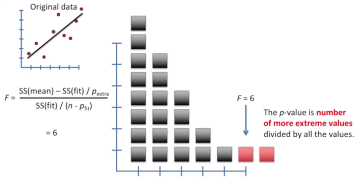

# Linear regression

**1.** Linear regression has two types: simple regression and multiple regression 

 

 

**2.** Sum of squared residuals: residuals are the differences between real data and the line, we are summing the   square of these values.

        Sum of squared residuals=((a*x1+b)-y1)2+((a*x2+b)-y2)2+.... -->cost function

 

**3.** We want the line that give us the smallest sum of squares, this method for finding the best values for “a”   and “b” is called “least squares” , we do this by taking the derivative and finding where it is equal to zero.   But sometimes it is very hard to find the value that makes it directly equal to zero,so we use gradientdescent method

**4.** Linear regression: Use least squares method to fit a line to the data ( We use R2 and P-value to evaluate the performance of the regression model )

 

**5.** R2 coefficient of determination: R2= SSR/ SST=1- SSE/ SSTquantifies the relationship in the data, needs to  be large
             (1)	SS(mean) =(data – mean)2  =SST (总平方和 ) 
             (2)	SS(fit) = (data – fit)2 =SSE (残差平方和 )
             (3)	SSR (回归平方和 ) = (fit – mean)2
             (4)	Var(mean) = (data – mean)2/n = SS(mean)/n
             (5)	Var(fit) = (data – fit)2/n = SS(fit)/n

 

There is a 60% reduction in variance when we take the mouse weight into account, or Mouse weight explains 60% of the variance in mouse size.

**6.** F-score:

 

**7.** P-value: determines how reliable that relationship is, needs to be small

 

According to the above graph: p-value=2/23=0.0895

Regression analysis is a form of inferential statistics. The p-values help determine whether the relationships that you observe in your sample also exist in the larger population. The p-value for each independent variable tests the null hypothesis that the variable has no correlation with the dependent variable.

If the p-value for a variable is less than your significance level, your sample data provide enough evidence to reject the null hypothesis for the entire population. Your data favor the hypothesis that there is a non-zero correlation. Changes in the independent variable are associated with changes in the response at the population level. This variable is statistically significant and probably a worthwhile addition to your regression model. On the other hand, a p-value that is greater than the significance level indicates that there is insufficient evidence in your sample to conclude that a non-zero correlation exists.

**8.** MSE: mean squared error, another loss function, similar to Sum of squared error.
       mean squared error=expectation of the squared error (误差平方的期望)

**9.** Gradient descent:  a way to achieve minimum squares of error, this method can also be used to optimize other things.
    Gradient descent has three types: 
       •	Batch gradient descent
       •	Mini-batch gradient descent
       •	Stochastic gradient descent

 

 

    (1)Batch gradient descent
    
       •	In each iteration step, all the data of the training set should be used. If the number of samples is             
            large, the speed is slow.
            
       •	Gradient decent only does few calculations far from the optimal solution, and increases  
            the number of the calculations closer to the optimal value--> Gradient decent identifies the optimal            
            value by taking big steps when it is far away and baby steps when it is close.
            
       •	We take the derivative of the sum of the squared residuals (loss function)
       
       •	Calculation process example:
                      **Step one:**
                        Sum of the squared residuals=(1.4 - (intercept + slope*0.5))2
                                                    +(1.9 - (intercept +slope*2.3))2
                                                    +(3.2 - (intercept +slope*2.9))2
                      **Step two:**
                        d/d intercept sum of the squared residuals=
                                                     -2(1.4 - (intercept + slope*0.5)
                                                    +-2(1.9 - (intercept + slope*2.3)
                                                    +-2(1.9 - (intercept + slope*2.3)
                        d/d slope sum of the squared residuals=
                                                    -2*0.5(1.4 - (intercept + slope*0.5)
                                                    +-2*2.9 (1.9 - (intercept + slope*2.3)
                                                    +-2*2.3 (1.9 - (intercept + slope*2.3)
                      **Step three:** start by taking intercept = 0 and slope = 1
                        d/d intercept sum of the squared residuals=
                                                     -2(1.4 - (0 + 1*0.5)
                                                    +-2(1.9 - (0 + 1*2.3)
                                                    +-2(1.9 - (0+ 1*2.3)=-1.6
                        d/d slope sum of the squared residuals=
                                                     -2*0.5(1.4 - (0 + 1*0.5)
                                                    +-2*2.9 (1.9 - (0 + 1*2.3)
                                                    +-2*2.3 (1.9 - (0 + 1*2.3)=-0.8
                      **Step four:** 
                        Step size intercept= -1.6*learning rate=-1.6*0.01=-0.016
                        Step size slope= -0.8*learning rate= -0.8*0.01=-0.008
                        
                      **Step five:**
                        New intercept=old intercept – step size= 0.016
                        New slope=old slope – step size = 1.008
                        
                        Return to step 3 and redo the following steps until the step size is extremely close to 0. 
                        Then we got the final slope an intercept for the fitting line

    (2)Stochastic gradient descent
        
       •	Stochastic gradient descent is especially useful then there are redundancies in the data. It is great             
            when there is tons of data and a lot of parameters. And can easily update the parameters when new     
            data shows up       

 

 

    (3)Mini-batch gradient descent
        
       •	Select mini-batch for each step
       •	Take the best of using just one sample and all of the data at each step. Similar to using all of the   
            data, using a mini-batch can result in more stable estimates of the parameters in fewer steps. Like    
            using just one sample per step, it is much faster than using all of the data

 

    10.Note:

    (1) the result of gradient descent is not always the greatest result due to the different initial intercept and 
        slope. But still towards to the optimization direction.

 

 

    (2) learning rate should be carefully chosen, can’t be too small  (too slow), can’t be too large(can’t reach         
        the optimize point). Can try 0.2/ 0.03/ 0.01/ 0.003/ 0.001/ 0.0003/ 0.0001..

 

